# COMANDOS BÁSICOS DE PRÁCTICA GIT PARA LA TERMINAL DE GIT BASH

> **`cd`** : nos permite cambiarnos de carpeta, **p.ej.** cd NuevaCarpeta.

> **`cd .. `** : nos permite regresar al directorio o carpeta anterior.

> **`cd o cd ~`** : nos lleva a la ruta del usuario.

> **`cd /c`** : nos vamos al disco C:/.

> **`cd -`** : nos lleva directamente al ultimo directorio visitado.

> **`ls`** : nos permite ver los archivos de la carpeta donde estamos actualmente.

> **`ls -l`** : Ver todos los archivos como una lista en donde incluye el usuario, grupo, permisos sobre el archivo, tamaño, fecha y hora de creación.

> **`ls -lh`** : Muestra la misma información que ls-l pero con unidades de tamaño, es decir, kb o mb.

> **`ls-R`** : muestra el contenido de todos los sudirectorios de forma recursiva.

> **`ls -S`** : Ordena los resultados por tamaño de archivo.

> **`PWD`** :Nos muestra la carpeta actual en la que nos encontramos.

> **`pwd`** : nos muestra la carpeta actual en la que nos encontramos.

> **`mkdir`** : nos permite crear carpetas, **p.ej.** mkdir NuevaCarpeta

> **`touch`** : nos permite crear archivos nuevos, **p.ej.** touch NuevoArchivo.txt

> **`cat`** : nos permite ver el contenido de un archivo, **p.ej.** cat NuevoArchivo.txt

> **`rm`** : Nos permite borrar un archivo o carpeta ej: **rm NuevoArchivo.txt**

> **`rmdir <<nombre del directorio>>`** : borrar un directorio: **Solo funciona con directorios vacíos.**

> **`rm -r <<nombre de la carpeta>>`** : me permite eliminar la carpeta y los archivos dentro de ella de forma recursiva.

> **`cp <<nombre del archivo que quremos copiar>> <<nombre del directorio a donde lo queremos copia>>`**: nos permite copiar un archivo.

> **`mv <<el directorio de donde queremos mover>> <<el nombre del archivo el directorio hacia donde lo queremos mover>>`** : **nos permite mover un archivo.**

> **`clear`** : nos permite limpiar la pantalla.

> **`history`** : ver los últimos comandos que ejecutamos y un número especial con el que podemos volver a repetir el comando.

---
# **Los tres estados de GIT**

> Git
tiene tres estados principales en los que se pueden encontrar tus archivos:
>1. **Confirmado (committed)**, significa que los
datos están almacenados de manera segura en tu base de datos local.
>2. **Modificado (modified)**, significa que has modificado el archivo pero todavía no lo has confirmado a tu base de
datos.
>3. **Preparado (staged)**, significa que has marcado un archivo modificado en su versión actual
para que vaya en tu próxima confirmación.
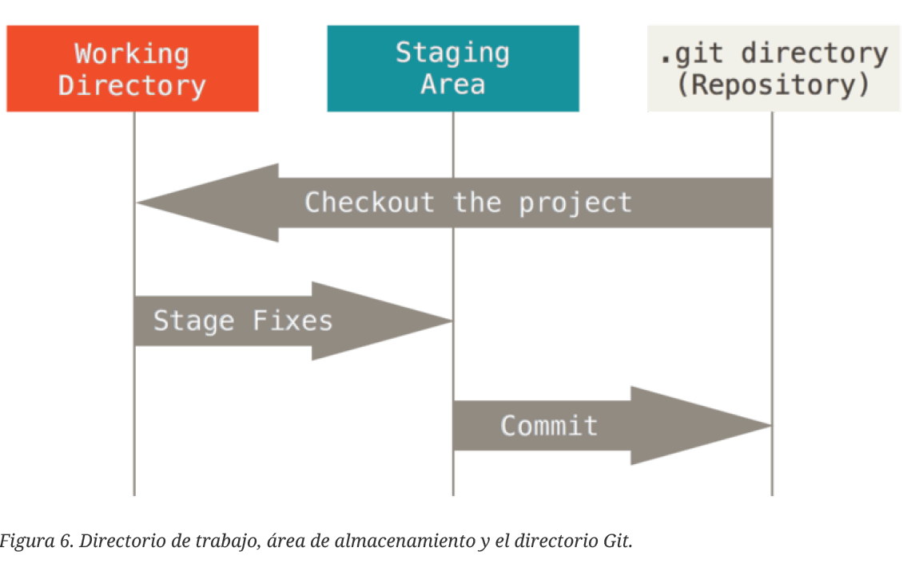

---

# **Configurando Git por primera vez.**

> Estableciendo nombre de usuario y dirección de correo electronico. **`git config --gobal user.name "nombreUsuario"`** **`git config --gobal user.email "correo electrónico"`** **`git config --gobal core.editor emacs`**

#### **Comprobando la configuración.**
> **`git cofig --list`**

> **`git config user.name`**

> **`git config user.email`**

---
#### **¿Como obtener ayuda?.**
> **`git help <verb>`**

> **`git <verb> --help`**

> **`man git-<verb>`**

> **`git help config`**
---

# **Fundamentos de GIT.**
> Puedes obtener un proyecto Git de dos maneras. La primera es tomar un proyecto
o directorio existente e importarlo en Git. La segunda es clonar un repositorio existente
en Git desde otro servidor.

---
#### **Inicializando un repositorio en un directorio existente.**

> Si estás empezando a seguir un proyecto existente en Git, debes ir al directorio del
proyecto y usar el siguiente comando:

> **`git init`** , Esto crea un subdirectorio nuevo llamado .git, el cual contiene todos los archivos
necesarios del repositorio – un esqueleto de un repositorio de Git. Todavía no hay nada
en tu proyecto que esté bajo seguimiento.

---
#### **Clonando un repositorio existente.**

> Si deseas obtener una copia de un repositorio Git existente por ejemplo, un
proyecto en el que te gustaría contribuir el comando que necesitas es:

> `git clone <URL de repositorio remoto>`  

---
#### **Guardando cambios en el repositorio.**

> Ya tienes un repositorio Git y un checkout o copia de trabajo de los archivos de
dicho proyecto. El siguiente paso es realizar algunos cambios y confirmar instantáneas
de esos cambios en el repositorio cada vez que el proyecto alcance un estado que
quieras conservar.

> Recuerda que cada archivo de tu repositorio puede tener dos estados: **rastreados** y **sin
rastrear**. 

> Los archivos **_rastreados_** (tracked files en inglés) son todos aquellos archivos que
estaban en la última instantánea del proyecto; pueden ser archivos sin modificar,
modificados o preparados. 

> Los archivos **_sin rastrear_** son todos los demás, cualquier otro
archivo en tu directorio de trabajo que no estaba en tu última instantánea y que no
está en el **área de preparación** (**_staging area_**). 

> Cuando clonas por primera vez un
repositorio, todos tus archivos estarán rastreados y sin modificar pues acabas de sacarlos
y aun no han sido editados.
Mientras editas archivos, Git los ve como modificados, pues han sido cambiados
desde su último commit. Luego preparas estos archivos modificados y finalmente
confirmas todos los cambios preparados, y repites el ciclo.
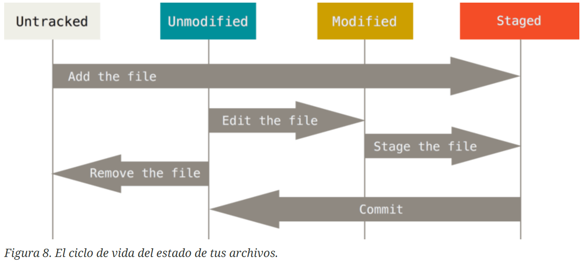

---
#### **Revisando el Estado de tus Archivos.**
> `git status` , determina que archivos estan en que estados. 

>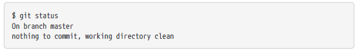
Esto significa que tienes un directorio de trabajo limpio, en otras palabras, que no hay
archivos rastreados y modificados. Además, **Git** no encuentra archivos sin rastrear,
de lo contrario aparecerían listados aquí. Finalmente, el comando te indica en cuál rama
estás y te informa que no ha variado con respecto a la misma rama en el servidor.

>Supongamos que añades un nuevo archivo a tu proyecto, un simple README. Si el
archivo no existía antes y ejecutas `git status`, verás el archivo sin rastrear de la siguiente manera:
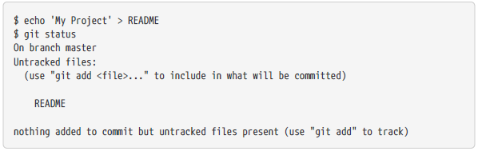

> Puedes ver que el archivo README está sin rastrear porque aparece debajo del
encabezado **“Untracked files”** (_“Archivos no rastreados”_ en inglés) en la salida. **Sin
rastrear** significa que **Git** ve archivos que no tenías en el commit anterior. **Git**
no los incluirá en tu próximo commit a menos que se lo indiques explícitamente. Se
comporta así para evitar incluir accidentalmente archivos binarios o cualquier otro
archivo que no quieras incluir. Como tú sí quieres incluir README, debes comenzar a
rastrearlo.

---
#### **Rastrear Archivos Nuevos**

> Para comenzar a rastrear un archivo debes usar el comando `git add.` Para comenzar a
rastrear el archivo README, puedes ejecutar lo siguiente:

> `git add <archivo>`

>Ahora si vuelves a ver el estado del proyecto, verás que el archivo README está siendo
rastreado y está preparado para ser confirmado:
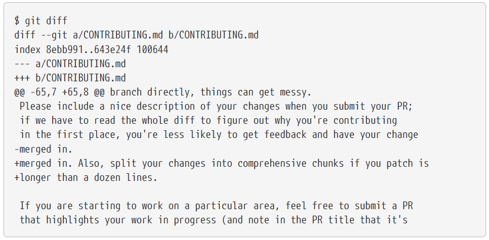

Puedes ver que está siendo rastreado porque aparece luego del encabezado **“Cambios a
ser confirmados”** (**_“Changes to be committed”_** en inglés). Si confirmas en este punto, se
guardará en el historial la versión del archivo correspondiente al instante en que
ejecutaste `git add`. Anteriormente cuando ejecutaste `git init` , ejecutaste luego `git add
<files>` , lo cual inició el rastreo de archivos en tu directorio. El comando `git add`
puede recibir tanto una ruta de archivo como de un directorio; si es de un directorio,
el comando añade recursivamente los archivos que están dentro de él.

---
#### **Preparar Archivos Modificados.**

> Vamos a cambiar un archivo que esté rastreado. Si cambias el archivo rastreado llamado
**“CONTRIBUTING.md”** y luego ejecutas el comando git status, verás algo parecido a esto:

>El archivo **“CONTRIBUTING.md”** aparece en una sección llamada **_“Changes not staged for
commit”_** (**_“Cambios no preparado para confirmar”_** en inglés), lo que significa que existe
un archivo rastreado que ha sido modificado en el directorio de trabajo pero que aún
no está preparado. Para prepararlo, ejecutas el comando `git add`. `git add` es un comando
que cumple varios propósitos; lo usas para empezar a rastrear archivos nuevos,
preparar archivos, y hacer otras cosas como marcar archivos en conflicto por
combinación como resueltos. Es más útil que lo veas como un comando para **_“añadir
este contenido a la próxima confirmación”_** más que para **_“añadir este archivo al
proyecto”_**. Ejecutemos `git add` para preparar el archivo **_“CONTRIBUTING.md”_** y luego
ejecutemos `git status`:
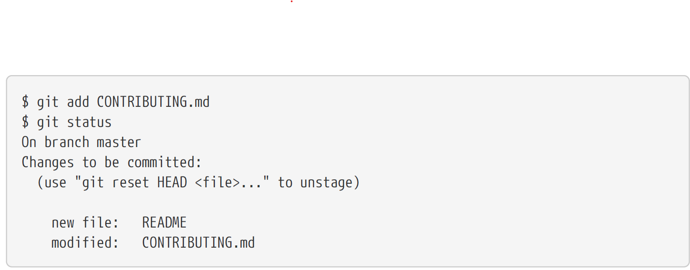

> Ambos archivos están preparados y formarán parte de tu próxima confirmación. En este
momento, supongamos que recuerdas que debes hacer un pequeño cambio en
**CONTRIBUTING.md** antes de confirmarlo. Abres de nuevo el archivo, lo cambias y ahora
estás listos para confirmar. Sin embargo, ejecutemos `git status` una vez más:
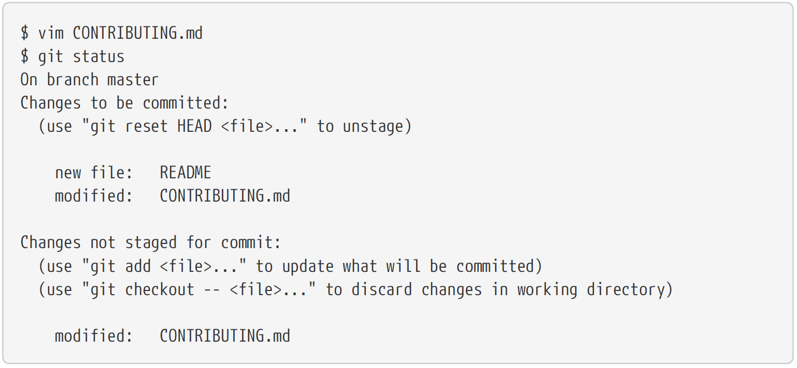

>¡¿Pero qué…?! Ahora CONTRIBUTING.md aparece como **preparado** y como **no preparado**.
¿Cómo es posible? Resulta que **Git** prepara un archivo de acuerdo al estado que
tenía cuando ejecutas el comando `git add`. Si confirmas ahora, se confirmará la versión
de **CONTRIBUTING.md** que tenías la última vez que ejecutaste `git add` y no la versión que
ves ahora en tu directorio de trabajo al ejecutar `git status`. Si modificas un archivo
luego de ejecutar `git add`, deberás ejecutar `git add` de nuevo para preparar la última
versión del archivo:
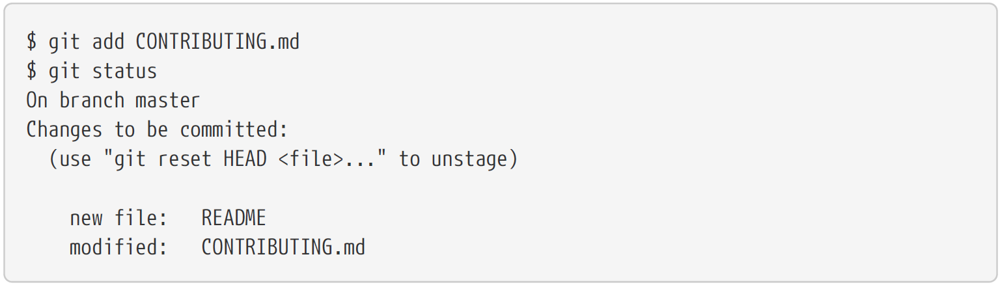

---
#### **Estado Abreviado.**

> `git status -s` , Muestra el estado de los archivos de modo abreviado.
Los archivos nuevos que no están rastreados tienen un _??_ a su lado, los archivos que
están preparados tienen una _A_ y los modificados una _M_.

---
#### **Ignorar archivos.**

> A veces, tendrás algún tipo de archivo que no quieres que Git añada
automáticamente o más aun, que ni siquiera quieras que aparezca como no rastreado.

> `cat .gitignore` , crea el archivo que contendrá en texto los nombres y extensiones que este no se agregará en el repositorio.

> `*.[oa]` , le indica a Git que ignore cualquier archivo que termine en _“.o”_ o
_“.a”_.

> `*~` , indica a Git que ignore todos los archivos que terminen con una
tilde.

También puedes incluir cosas como **trazas, temporales, o pid**
directamente; documentación generada automáticamente; etc. **_Crear un archivo `.gitignore`
antes de comenzar a trabajar es generalmente una buena idea_**, pues así evitas confirmar
accidentalmente archivos que en realidad no quieres incluir en tu repositorio Git.

Las reglas sobre los patrones que puedes incluir en el archivo `.gitignore` son las
siguientes:

* Ignorar las líneas en blanco y aquellas que comiencen con `#`.
* Emplear patrones glob estándar que se aplicarán recursivamente a todo el directorio
del repositorio local.
* Los patrones pueden comenzar en barra (`/`) para evitar recursividad.
* Los patrones pueden terminar en barra (`/`) para especificar un directorio.
* Los patrones pueden negarse si se añade al principio el signo de exclamación (`!`).

>Los patrones glob son una especie de _expresión regular_ simplificada usada por los
terminales. Un asterisco **(`*`) corresponde a cero o más caracteres**; **`[abc]` corresponde a
cualquier caracter dentro de los corchetes (en este caso a, b o c)**; el signo de
interrogación (`?`) **corresponde a un caracter cualquiera**; y los corchetes sobre caracteres
separados por un guión (`[0-9]`) **corresponde a cualquier caracter entre ellos (en este
caso del 0 al 9)**. También puedes usar dos asteriscos (`**`) para indicar directorios anidados;
`a/**/z` coincide con `a/z`, `a/b/z`, `a/b/c/z`, etc.
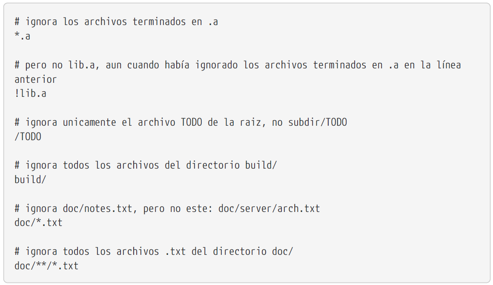

---
#### **Ver los Cambios Preparados y No Preparados**

> `git diff` , realiza una visualización del código sobre lo que se ha modificado o cambiado.

> **Ejp.** Supongamos que editas y preparas el archivo **README** de nuevo y luego editas
**CONTRIBUTING.md** pero no lo preparas. Si ejecutas el comando `git status`, verás algo como
esto: 
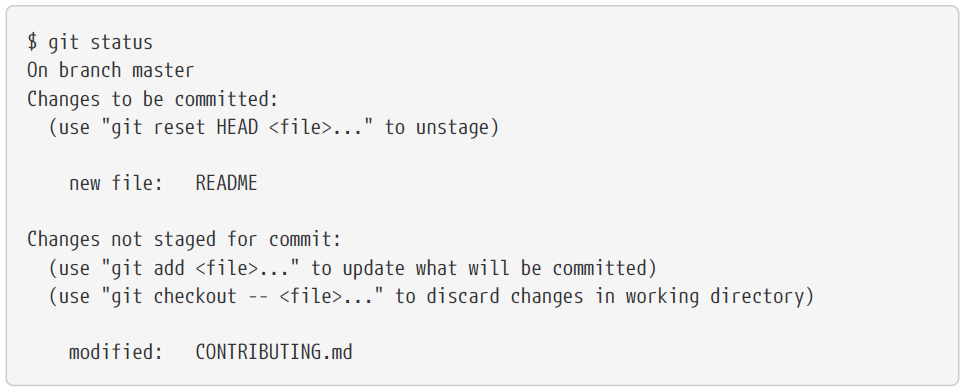

>Para ver qué has cambiado pero aun no has preparado, escribe `git diff` sin más
parámetros:

Este comando compara lo que tienes en tu **_directorio de trabajo_** con lo que está en el
**_área de preparación_**. El resultado te indica los cambios que has hecho pero que aun no
has preparado.

> Si quieres ver lo que has preparado y será incluido en la próxima confirmación, puedes
usar `git diff --staged`. Este comando compara tus cambios preparados con la última
instantánea confirmada.
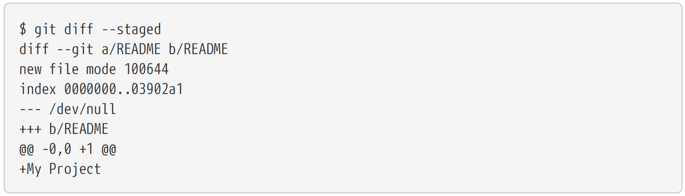
Es importante resaltar que al llamar a `git diff` sin parámetros no verás los cambios
desde tu última **confirmación**, solo verás los cambios que aun no están **preparados**.
Esto puede ser confuso porque si preparas todos tus cambios, `git diff` no te devolverá
ninguna salida.

>Pasemos a otro ejemplo, si preparas el archivo **CONTRIBUTING.md** y luego lo editas, puedes
usar `git diff` para ver los cambios en el archivo que ya están preparados y los
cambios que no lo están. Si nuestro ambiente es como este:
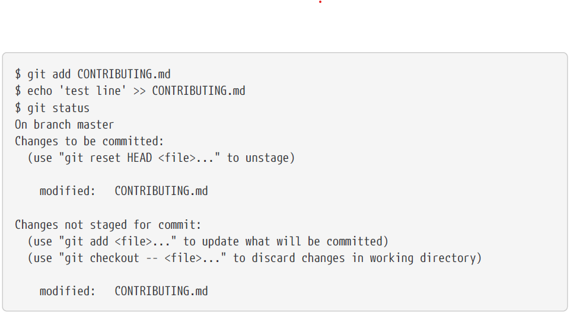

> Puedes usar `git diff` para ver qué está sin preparar 
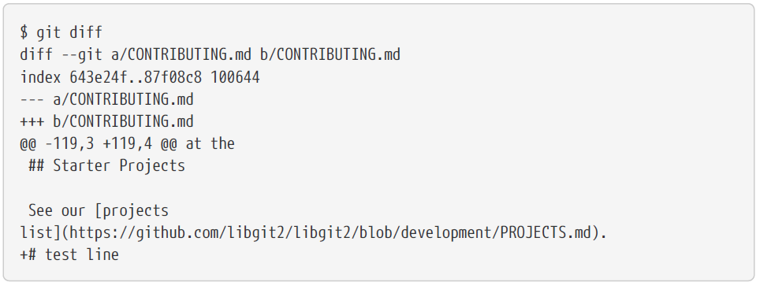

> `git diff --cached` , para ver que has preparado hasta ahora (`--staged` y `--cached` son
sinónimos):

---
#### **Confirmar tus Cambios.**
> `git commit -m "Mensaje de descripción"` , confirma cambio que estan en el área de preparación.

---
#### **Saltar el Área de Preparación.**
> `git add -am "Mensaje de descripción"` , Salta el area de **preparación** y realiza el **commit** directamente.  

---
#### **Eliminar Archivos avanzado.**
> `git rm --cached <nombre archivo/ruta archivo>` , matiene el archivo en tu directorio de trabajo
pero eliminarlo del área de preparación. En otras palabras, quisieras mantener el
archivo en tu disco duro pero sin que Git lo siga rastreando.

> Al comando git rm puedes pasarle archivos, directorios y patrones glob. Lo que significa
que puedes hacer cosas como: 

> `git rm log/\*.log`, Este comando elimina todos los archivo que tengan la extensión .log dentro
del directorio `log/`.

> `git rm \*~` , Este comando elimina todos los archivos que acaben con **`~`**.

---
#### **Ver el Historial de Confirmaciones.**

> `git log` , visualiza el historial de modficaciones del repositorio.

> `git log -p -2` , **`-p`** que muestra las diferencias introducidas en cada
confirmación. También puedes usar la opción **`-2`**, que hace que se muestren únicamente
las dos últimas entradas del historial.

> `git log --stat` , muestra estadísticas de cada confirmación. 

Otra opción realmente útil es `--pretty`, que modifica el formato de la salida.

> `git log --pretty=oneline` , La opción `oneline` imprime cada confirmación en una
única línea, lo que puede resultar útil si estás analizando gran cantidad de
confirmaciones.

> `git log --pretty=format:"%h - %an, %ar : %s"` , **`format`**, que te permite especificar tu propio formato. Esto
resulta especialmente útil si estás generando una salida para que sea analizada por otro
programa, como especificas el formato explícitamente, sabes que no cambiará en futuras actualizaciones de Git.

> Opciones útiles de git log `--pretty=format` lista algunas de las opciones más útiles
aceptadas por format.
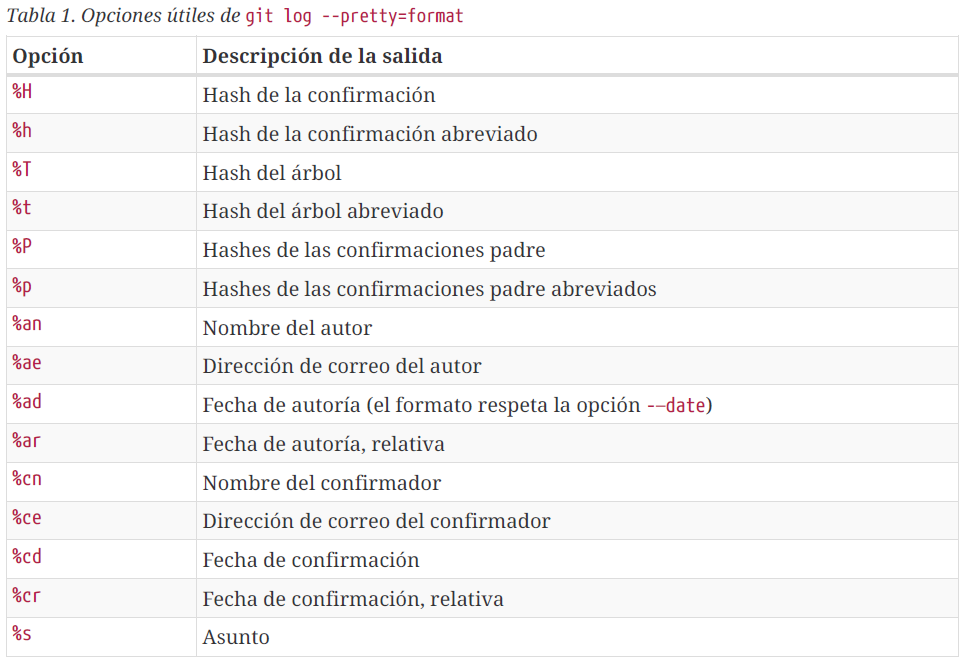
Puede que te estés preguntando la diferencia entre autor (author) y confirmador
(committer). El autor es la persona que escribió originalmente el trabajo, mientras que el
confirmador es quien lo aplicó. Por tanto, si mandas un parche a un proyecto, y uno
de sus miembros lo aplica, ambos recibiréis reconocimiento tú como autor, y el
miembro del proyecto como confirmador. Veremos esta distinción con mayor
profundidad en Git en entornos distribuidos.

> Las opciones `oneline` y `format` son especialmente útiles combinadas con otra opción
llamada `--graph`. Ésta añade un pequeño gráfico ASCII mostrando tu historial de
ramificaciones y uniones:
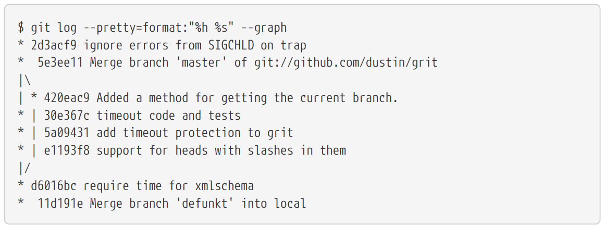

> Éstas son sólo algunas de las opciones para formatear la salida de `git log`.
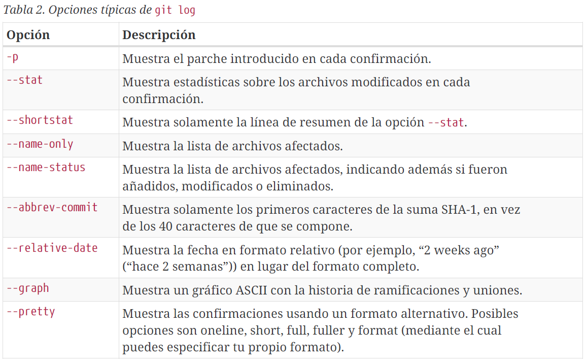

---
#### **Limitar la Salida del Historial (`--since` (desde) y `--until` (hasta)).**

> `git log --since=2.weeks` , este comando lista todas las confirmaciones hechas
durante las dos últimas semanas.

> `git log -Sfunction_name` , encuentra la ultima confirmación que añadió o eliminó una referencia a una función específica.

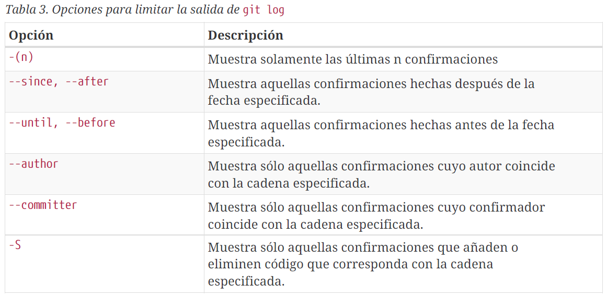

---
#### **Deshacer Cosas.**

> `git commit --amend` , este comando utiliza tu área de **preparación** para la confirmación. Si no has hecho
cambios desde tu última confirmación (**_por ejemplo, ejecutas este comando justo después
de tu confirmación anterior_**), entonces la instantánea lucirá exactamente igual y lo único
que cambiarás será el mensaje de confirmación.

>`git commit -m 'Mensaje confirmación'` 
 `git add forgotten_file` 
 `git commit --amend` 
Al final terminarás con una sola confirmación, la segunda confirmación reemplaza el
resultado de la primera.

---
#### **Deshacer un Archivo Preparado.**

> `git reset HEAD <file>...` , deshace la preparación.

>`git reset` puede ser un comando peligroso, especialmente si lo llamas con
la opción `--hard`. Sin embargo, en el escenario descrito anteriormente, el
archivo que está en tu directorio de trabajo no se toca, por lo que es
relativamente seguro.

---
#### **Deshacer un Archivo Modificado.**

> `git checkout -- <file>`  
Es importante entender que `git checkout -- <archivo>` es un
comando peligroso. Cualquier cambio que le hayas hecho a ese
archivo desaparecerá, acabas de sobreescribirlo con otro archivo.
Nunca utilices este comando a menos que estés absolutamente
seguro de que ya no quieres el archivo.

---
#### **Trabajar con Remotos.**

> `git remote` , comando que visualiza los remotos que tienes configurados, tambien mostrará los nombres de cada uno de los remotos que tienes especificados. 

> `git remote -v` , muestra las URLs que **git** ha asociado al nombre y estarán usadas al leer y escribir en ese remoto.
---
#### **Añadir Repositorios Remotos.**

> `git remote add <nombre instancia> <url>` , añade nombre de referencia al repositorio remoto y la URL a la cual el repo remoto está vinculada. Cuando se especifíca el nombre, este se puede utilizar en la línea de comandos en lugar de la URL.  **Ejp.**, si quieres traer toda la información que tiene Paul pero tú aún no tienes en tu repositorio, puedes ejecutar `git fetch nombre_dado_de_la_instancia`. La rama maestra de Paul ahora es accesible localmente con el nombre nombre_dado_de_la_instancia/master
---

#### **Traer y Combinar Remotos**

> `git fetch <remote-name>` El comando irá al proyecto remoto y se traerá todos los datos que aun no tienes de dicho remoto. Luego de hacer esto tendrás referencias a todas las ramas del remoto, las
cuales puedes combinar e inspeccionar cuando quieras. 
Si clonas un repositorio, el comando de clonar automáticamente añade ese repositorio remoto con el nombre **`“origin”`**. Por lo tanto, `git fetch origin` se trae todo el trabajo nuevo que ha sido enviado a ese servidor desde que lo clonaste (o desde la última vez que trajiste datos). Es importante destacar que el comando `git fetch` solo trae datos a tu repositorio local, ni lo combina automáticamente con tu trabajo ni modifica el trabajo que llevas hecho. La combinación con tu trabajo debes hacerla manualmente cuando estés listo.

> `git pull` , trae y combinar automáticamente la rama remota con tu rama actual.

